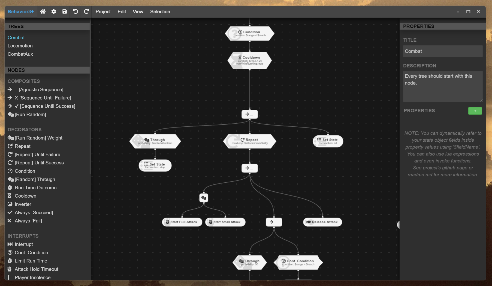

# Behavior3+ Editor



**Behavior3+ Editor** is primarily a standalone engine/library - agnostic behavior tree editor (but probably can still be hosted online) based on [Behaviour3 Editor](https://github.com/behavior3/behavior3editor).

_**Create** custom nodes, **develop** your bahavior trees, **export** them to JSON, parse them in your engine._

This version of the editor supports all of the _luabehaviourtree 2e_ (link is coming, it's also a fork I'm working on, not published yet) nodes out of the box and provides a visual and quality-of-life improvement over the original _Behaviour3 Editor_.

**New features** include:
- Cleaner overall visuals
- Node icons
- Property values displayed on the nodes in the tree
- New node type - Interrupts
- Automatic GitHub release builds
- Few other minor changes and bug fixes

Behaviour3+ Editor and _luabehaviourtree 2e_(TODO: add link) were actively used in the development of _Combat AI Behavior Overhaul_ for [OpenMW](https://openmw.org/)

## Installation

- Get the latest release from [Releases](https://github.com/MaxYari/behavior3editorplus/releases) page (Linux or Windows).
- On Windows ignore any warnings about unrecognized applications, click "more"->"Run anyway" and proceed with the installation. Trusted code certificates cost a lot and this is a hobby project :)

## Documentation

Take a look at _luabehaviourtree 2e_(TODO: add link) for a short introduction to behavior trees and an overview of the most important nodes, all while referencing screenshots from this very editor. 
Additionally, "behavior trees" are a general concept used in games, engines and robotics - so you should be able to find plenty of information online. 

## Running from Source

If you can't find an appropriate release for your OS or simply want to run directly from the source code - here's how:

### Prerequisites
- Install Node.js (v20.11.0 recommended), you can find a list of [Node.js releases here](https://nodejs.org/dist/).
- Download this repository, either with `git clone` or manually.
- Open the console in the repository folder and run the following list of commands to install the dependencies (only need to be installed once):
```bash
npm install
npx bower install
npm run builddev
```
- After that - you can run the following console command (still from the app's folder) to start the editor:
```bash
npm run start
```


## Why Behavior3+ Editor?

Why should you use b3editor? What is different from other editors? Can it compete against commercial alternatives? - Well, check it out some characteristics of Behavior3+ Editor:

- **Open Source Software**: under MIT license, you can use this software freely, adapt it to your need and even use a specialized internal version in your company. You can also contribute with bug fixes, suggestions and patches to make it better.

- **Open Format**: b3editor can export the modeled trees to JSON files, following an open format. If there is no official reader on your favorite language yet, you can develop your own library and use the trees created here. 

- **Focus on Usability**: An easy, clean, and intuitive tool for programmers and non-programmers. If there is something obscure or too difficult to use, report it immediately!

- **Customizable**: create your own node types and customize nodes instances individually. Create several projects and trees, change titles and add properties.

- **Does not depends on other tools/editors/engines**.


## Main features

- **Custom Nodes**: you can create your own node types inside one of the four basic categories - *composite*, *decorator*, *action* or *condition*. 
- **Individual Node Properties**: you can modify node titles, description and custom properties.
- **Manual and Auto Organization**: organize by dragging nodes around or just type "a" to auto organize the whole tree.
- **Create and Manage Multiple Trees**: you can create and manage an unlimited number of trees.
- **Import and Export to JSON**: export your project, tree or nodes to JSON format. Import them back. Use JSON on your own custom library or tool. You decide.


## Limitations

Nothing is perfect =( . When running in a browser - Behavior3 Editor focus on Chrome(ium) (thus, working pretty well on Opera too), so it have some incompatibilities with Firefox, such as the image preview lag when dragging to create a node for the first time, and the ugly scroll bar inside the panels. Not tested on IE!


## Looking for Behavior Tree Libraries?

- luabehaviourtree 2e
- https://github.com/behavior3/behavior3js
- https://github.com/behavior3/behavior3py

